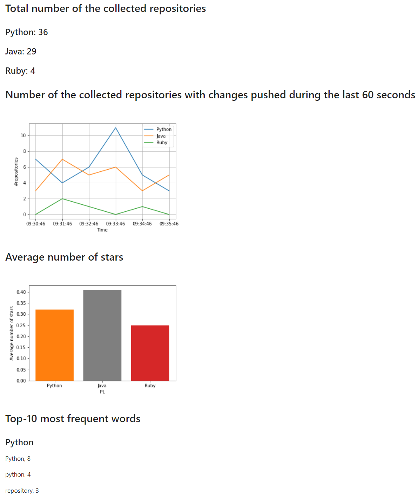

# Real-Time Streaming Analytics of GitHub Repos with Apache Spark, Docker, and Flask

## Introduction
This project performs real-time streaming analytics for public repositories hosted on GitHub. The system runs a stream processing pipeline, where the live data stream to be analyzed is coming from GitHub API. An Apache Spark cluster processes the data stream. A web application receives the output from Spark and visualizes the analysis result.

## Description of the System Architecture

This application consists of four components, as illustrated in the diagram above. Firstly, the Data Source Service makes a request to the 
GitHub API to retrieve repository data. The GitHub API sends it the 
repository data in JSON format. The Data Source Service then takes 
only the relevant information from the JSON, streams it over to the 
Apache Spark Cluster via TCP. The Apache Spark Cluster then 
analyzes this data and sends some key statistics over to the Webapp 
Service, which uses these statistics to show graphical visualizations. Finally, 
the user can see these visualized statistics by visiting the webapp 
service through localhost:5000.

## Implementation

### 3. Web Application
The web application visualizes the analysis results in real-time, which doesn't need to be fancy. A simple dashboard such as shown in the figure below would suffice. You can easily create a web application using web frameworks, such as [Flask](https://flask.palletsprojects.com/en/2.0.x/) and [Django](https://www.djangoproject.com/). Also, a simple [Flask-based dashboard](https://github.com/pacslab/big-data-systems-docker/blob/main/spark/app/nine-multiples/webapp/flask_app.py) is presented in Lab 7. You can modify its source code to implement the web application for this project.

